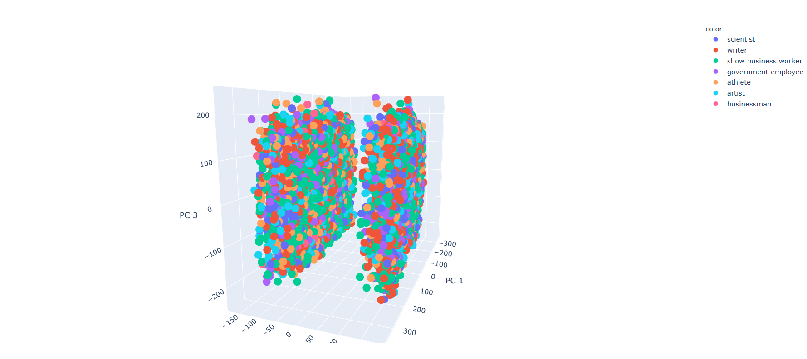

# VedicAstrologer

Astrologers in ancient India believed that through knowing the relative positions of celestial
bodies i.e. (the Sun, the moon, planets in the solar system) at the exact time of a persons birth 
could be used to determine their destiny. I decided to investigate this by using machine learning to 
predict a person's occupations based on the exact date, time and location of their birth and the 
positions of celestial bodies at this time.

What I did:
- Used beuatiful soup to scrape birth data of famous actors, scientists, musicians, athletes etc. 
from two websites (https://celebrity.astrosage.com/ and https://famouspeople.astro-seek.com/). Data
  included the date and exact time of each persons birth, the latitude and longitude of the birth place
  as well as their current occupation.
- Used an API provided by https://vedicrishi.in/web-astro-api to query the positions of the 
celestial bodies in the solar system during the time of each persons birth in the datasets compiled
  from the above.
- Processed and combined the datasets above to create the features (birth data and planetary positions)
and labels (occupations) for training the ML models.
- Trained a series of models (logistic regresion, SVM, Random Forest, XGBoost) none of which 
were able to predict a persons occupation any better than random chance (surprise, surprise!)
- I relabelled the dataset to cut down on the unique number of classes and remove classes which 
made up too small a proportion of the whole dataset and was left with just 7 occupations. This did
  little to improve performance. 
- The plot of training data against the 3 principal components derived through PCA is shown below:

- The two groups suggest that there may be details in the information captured within 
the training features inherent to which of the two websites that the birth data was scraped from, and so
  the models themselves may have learned to predict this instead of occupation :(.
- Ultimately my experiments did not support the theories behind Vedic astrology, but that is not
sufficient to rule the practice out completely.
- I may come back to this one day and have another go.